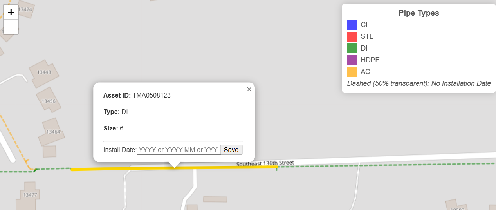

# Water Pipes Installation Year Project

This project aims to update and manage the installation year of water pipes on a map. The application provides an interactive web interface to visualize pipe data, highlight missing installation dates, and update them as needed.

## Project Overview

The project consists of a Flask web application that:
- Renders a map displaying water pipes.
- Lists pipes with missing installation dates.
- Allows users to update the installation year through a popup form.

An infrastructure setup using Terraform automates the deployment on AWS, including the necessary EC2 instance, EFS file system, and security groups.

## File Structure

Below is a summary of the key files and directories. Click on any file name to view its contents:

- [templates/index.html](templates/index.html)  
  Contains the HTML and JavaScript that build the map interface, display the sidebar, and handle user interactions.

- [app.py](app.py)  
  The Flask application responsible for serving the web pages, handling data requests, and processing updates to the installation year.

- [terraform/main.tf](terraform/main.tf)  
  Defines the infrastructure components on AWS, including the EC2 instance and file system setup needed for the application.

- [misc/popup_for_installation_year_entry.png](misc/popup_for_installation_year_entry.png)  
    
  This screenshot shows the popup used for entering the installation year of a water pipe.

## How It Works

1. **Map Interface:**  
   The [index.html](templates/index.html) file sets up a Leaflet map displaying water pipes. It includes a sidebar that lists pipes missing installation dates.

2. **Data Update:**  
   When a user clicks on a pipe feature, a popup (as shown above) is presented. This form allows the user to enter a valid installation year, which is then submitted via an API endpoint in [app.py](app.py).

3. **Backend Processing:**  
   The Flask app in [app.py](app.py) handles the following:
   - Loading the shapefile data.
   - Updating the installation year in the data.
   - Serving the updated data as GeoJSON.
   - Packaging updated shapefile data for download.

4. **Infrastructure Deployment:**  
   The [main.tf](terraform/main.tf) file in the Terraform directory automates the AWS deployment process. It configures security groups, EFS, and an EC2 instance to run the Flask application.

## Installation and Setup

### Prerequisites

- **Python 3.6+** and **pip** installed on your machine.
- **Flask** and **GeoPandas** libraries. Install them using:
  ```bash
  pip install flask geopandas
  ```
- **Terraform** installed for AWS deployment.
- An AWS account with proper credentials configured.

### Local Development Setup

1. **Clone the Repository:**
   Clone this project repository to your local machine.
2. **Directory Structure:**
   Ensure your project directory contains:
   - [templates/index.html](templates/index.html)
   - [app.py](app.py)
   - [terraform/main.tf](terraform/main.tf)
   - [misc/popup_for_installation_year_entry.png](misc/popup_for_installation_year_entry.png)
3. **Prepare Your Shapefile:**
   Place your shapefile (and its related files) in a folder named `data` with the file `tempMainPipes.shp`.

4. **Run the Flask App Locally:**
   Execute the following command from the project root:
   ```bash
   python app.py
   ```
   The app will run on `http://0.0.0.0:5000` by default.

## Deployment with Terraform

The project includes a Terraform configuration to deploy the application infrastructure on AWS.

### Steps to Deploy

1. **Configure AWS Credentials:**
   Ensure your AWS CLI is configured with the necessary credentials and region settings.
2. **Review Terraform Configuration:**
   The configuration in [terraform/main.tf](terraform/main.tf) sets up:
   - AWS EC2 instance for the Flask application.
   - AWS EFS for storing shapefile data.
   - Security groups to allow inbound traffic for the Flask app and SSH.
3. **Initialize and Apply Terraform:**
   Navigate to the `terraform` directory and run:
   ```bash
   terraform init
   terraform apply
   ```
   Confirm the changes to deploy the resources. Terraform will output the public URL of the deployed Flask app.

4. **Remote Deployment:**
   The Terraform script uses remote-exec provisioners to:
   - Install necessary packages.
   - Mount the EFS.
   - Deploy the application files ([app.py](app.py) and [templates/index.html](templates/index.html)) to the EC2 instance.
   - Start the Flask application.

## Usage

### Application Workflow

1. **Access the Map Interface:**
   Open the provided public URL (from Terraform output) in your browser to view the interactive map.
2. **Identifying Missing Install Dates:**
   The left sidebar lists water pipes with missing installation dates.
3. **Updating Installation Year:**
   - Click on a listed pipe or directly on a pipe feature on the map.
   - A popup form appears (as shown in [misc/popup_for_installation_year_entry.png](misc/popup_for_installation_year_entry.png)). Enter the installation date in the accepted formats (YYYY, YYYY-MM, or YYYY-MM-DD).
   - Submit the form to update the record.
4. **Download Updated Data:**
   Use the "Download Updated Shapefile" link in the sidebar to obtain the updated shapefile package.

## Troubleshooting and Additional Information

- **Form Validation:**
  The popup form validates the input date format using a regular expression. Ensure dates are formatted correctly.
- **API Responses:**
  - A successful update returns a JSON response with status `success`.
  - Errors in submission will return a JSON response with an error message. Check the browser console or server logs for more details.
- **Map Interaction:**
  The Leaflet map automatically highlights selected features and adjusts its view based on user interactions.
- **AWS Deployment:**
  - Verify that the security groups allow traffic on the correct ports.
  - Check the EC2 instance logs (via SSH or the provided log output in Terraform) if the Flask app is not responding.
- **Data Persistence:**
  The application uses an EFS mount for data persistence. Make sure that the EFS is correctly mounted on your EC2 instance.

For further assistance, consult the code comments within [app.py](app.py) and [terraform/main.tf](terraform/main.tf), which provide insights into each functional block of the project.
